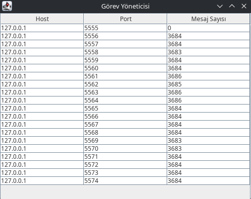
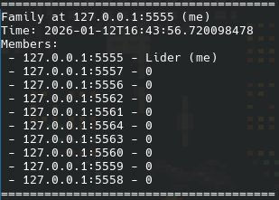
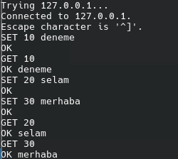
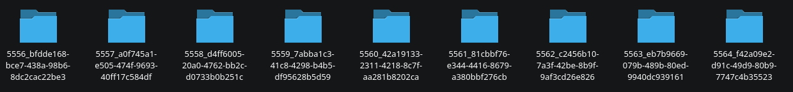

Distributed-Disk-Registery (gRPC + TCP)
=======================================

---


# gRPC + Protobuf + TCP Hybrid Distributed Server

Bu proje, birden fazla sunucunun dağıtık bir küme (“family”) oluşturduğu, **gRPC + Protobuf** ile kendi aralarında haberleştiği ve aynı zamanda **lider üye (cluster gateway)** üzerinden dış dünyadan gelen **TCP text mesajlarını** tüm üyelere broadcast ettiği hibrit bir mimari örneğidir.

Sistem Programlama, Dağıtık Sistemler veya gRPC uygulama taslağı olarak kullanınız.

---

## 👨🏻‍💻 Özellikler
- Dinamik Node Keşfi: Yeni başlayan node'lar, mevcut ağa otomatik olarak katılır.

- Lider Node Mekanizması: 5555 portunda çalışan ilk node "Lider" olarak işlem yapar.

- TCP Komut Arayüzü: Lider node, 6666 portu üzerinden TCP bağlantılarını Telnet üzerinden dinler ve SET/GET komutlarını istenilene göre çalıştırır.

- Görsel İzleme Paneli (Task Manager): Lider node üzerinde çalışan Swing tabanlı arayüz ile ağdaki node'ların ve mesaj yüklerinin durumu izlenebilir.

- Health Checking: Sistem, düşen node'ları tespit eder ve ağ listesinden çıkarır (Health Checking).

- Veri Replikasyonu: Mesajlar, tolerans dosyasında belirtilen seviyeye göre birden fazla node'a kopyalanır.

## 💬 Gereksinimler
- Java 17 veya üzeri
- Maven

## 📁 Proje Yapısı
```
distributed-disk-register/
│
├── messages/
├── pom.xml
├── README.md
├── TOLERANCE.conf
├── src
│   └── main
│       ├── java/com/example/family/
│       │       ├── NodeMain.java
│       │       ├── NodeRegistry.java
│       │       └── FamilyServiceImpl.java
│       │       └── StorageServiceImpl.java
│       │       └── ZeroCopyServiceImpl.java
│       │
│       └── proto/
│               └── family.proto
```
- NodeMain.java: Uygulamanın giriş noktası. Lider seçimini, servislerin başlatılmasını ve node keşfini yönetir.

- TaskManager.java: Swing tabanlı görsel arayüz. Ağ durumunu tablo halinde gösterir.

- FamilyServiceImpl.java: Node'lar arası iletişim (gRPC) mantığını içerir.

- StorageServiceImpl.java: Mesajların diske yazılmasını ve okunmasını Buffered IO sayesinde sağlar (messages/ klasörü altında).

- ZeroCopyServiceImpl.java: Mesajların diske yazılmasını ve okunmasını Zero-Copy ilkesi sağlar (messages/ klasörü altında).

- NodeRegistry.java: Aktif node'ların listesini tutan thread-safe yapı.

- TOLERANCE.conf: Verinin kaç farklı node'da yedekleneceğini belirler.

## 🔧 Kurulum ve Derleme
Projeyi kendi sisteminizde çalıştırmak için aşağıdaki komutu çalıştırın:
```
git clone https://github.com/salihefeserit/distributed-disk-register.git
```
Projeyi derlemek için proje dizininde aşağıdaki komutu çalıştırın:
```
mvn clean install
```
## ▶️ Çalıştırma
Sistemi başlatmak için NodeMain sınıfını çalıştırın. İdeal bir test ortamı için aşağıdaki adımları izleyebilirsiniz:

### 1. Lider Node'u Başlatma (Terminal 1)
İlk node her zaman 5555 portunda başlar ve Lider olur.
```
mvn exec:java -Dexec.mainClass=com.example.family.NodeMain
```
Not: Lider başladığında Task Manager penceresi de otomatik olarak açılacaktır.



### 2. Diğer Node'ları Başlatma (Terminal 2, 3, ...)
Farklı terminallerde NodeMain'i (veya lideri başlatmak için olan bash kodunu) tekrar çalıştırarak ağa yeni node'lar ekleyebilirsiniz. Sistem otomatik olarak boş bir port bulup (5556, 5557...) ağa dahil olacaktır.



### 3. Komut Gönderme (Telnet)
Lider node (5555), 6666 portundan komut bekler.

Terminal Üzerinden Telnete Bağlanma:
```
telnet 127.0.0.1 6666
```
Diskten Veri Okuma (GET) ve Diske Veri Yazma (SET):
```
SET 1 Naber
OK
GET 1
OK Naber
```
Örnek Proje Çıktısı:





